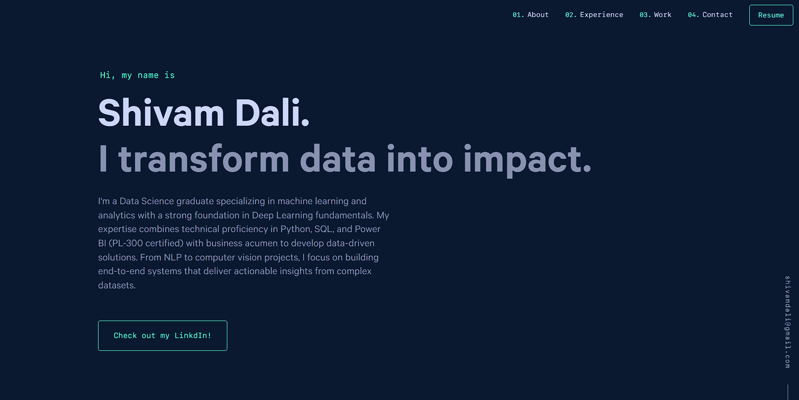

# 🚀 Shivam Dali | Data Science Portfolio

  
  
  

    
    
    
  

  
  <h3>✨ Transforming Data into Intelligence ✨</h3>

---
<h3 align="center">
  🌐 <strong><a href="https://portfolio-svd-v1-ita0o0lbu-svdexes-projects.vercel.app" target="_blank">💼 VIEW LIVE PORTFOLIO → shivamdali.com 🚀</a></strong>
</h3>

---
## 🧠 About Me • 💻 Portfolio Features • 🛠️ Technologies

**Data Science professional** with Master's from **University of Adelaide** • Combining technical expertise with business acumen • Focus: **Machine Learning**, **Data Visualization**, **End-to-End Pipelines**

**Portfolio Features:** ✅ Responsive Design • ✅ Interactive Projects • ✅ Dark/Light Mode • ✅ Optimized Performance

**Tech Stack:**        

---

## 🌟 Featured Projects

<table>
<tr>
<td width="33%">

<h3>📊 <a href="https://github.com/svdexe/PowerBI-MySQL-HR_Dashboard">HR Analytics Dashboard</a></h3>

Interactive dashboard with predictive insights and KPI tracking for workforce planning.

<strong>Stack:</strong>   

</td>
<td width="33%">

<h3>🐔 <a href="https://github.com/svdexe/Chicken_Disease_Classification">Disease Classification</a></h3>

CNN model for disease detection with <strong>95%+ accuracy</strong> using computer vision.

<strong>Stack:</strong>    

</td>
<td width="33%">

<h3>📝 <a href="https://github.com/svdexe/NLP_TextSummarizer">NLP Text Summarizer</a></h3>

Transformer-based automatic text summarization using BERT architecture.

<strong>Stack:</strong>   

</td>
</tr>
</table>

### 🌐 This Portfolio Website

Modern, responsive data science portfolio with interactive features, theme toggle, and optimized performance.

**Tech Stack:**      

---

## 🔧 Quick Start • 🌐 Deployment • 🙏 Credits

**Setup:** `git clone https://github.com/svdexe/portfolio-website.git` • `cd portfolio-website && npm install` • `npm start`

**Deploy:** Built with **Gatsby** • Deploy on **Netlify**, **Vercel**, or **GitHub Pages** • `npm run build` • `npm run serve`

**Attribution:** Built upon [Brittany Chiang's v4 template](https://github.com/bchiang7/v4) • Full credit to [brittanychiang.com](https://brittanychiang.com) • MIT License

---

## 📬 Let's Connect

  
**Open for opportunities • Freelance projects • Collaborations** • **[shivamdali@gmail.com](mailto:shivamdali@gmail.com)**

  

<i>"Data is the new oil. It's valuable, but if unrefined it cannot really be used."</i> — Clive Humby

⭐ **Star this repo if you found it helpful!** ⭐

